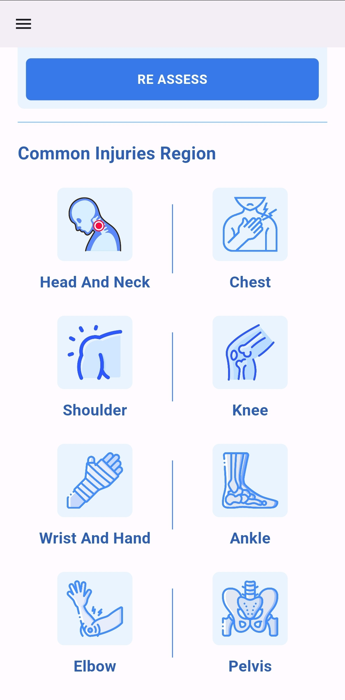

# Sports Injury

## Introduction
Sports Injury is a mobile application designed to help physiotherapists manage their Sports Patients and for the patients to keep it up with their physiotherapist.
## Features
- Doctor View : The doctor's view offers a streamlined experience for sports patient profiles. Doctors can add new patients via their ID, and access a list of existing patients. Doctors can also see what equipment should be inside their bag.

- Physiotherapist's Bag : The Physiotherapist's Bag feature provides a visual inventory of essential equipment for therapy sessions. With detailed photos, physiotherapists can quickly access and organize necessary tools for treatments. This streamlined approach ensures therapists are well-prepared, enhancing efficiency and quality of care during patient sessions

- Add New Patient : The Add New Patient Screen streamlines patient intake for physiotherapists. Beginning with patient ID entry and basic information input, it progresses to examination details, including injury region and suspected injury selection. Integration of patient radiology follows, enhancing diagnostic accuracy. A call-to-action prompts creation of a treatment program, facilitating seamless progression in patient care.

- Patient View : The Patient View Screen offers a comprehensive view of the patient's healthcare journey. It includes their basic information and their Radiology Images if found, and their treatment plan.

- Common Injuries Regions : The Common Injuries Regions screen aids physiotherapists in diagnosing and treating common injuries. They can access a library of injuries categorized by region, view detailed anatomy, and explore specific injuries with descriptions, images, mechanisms, and diagnostic tests. Lastly, therapists can access tailored treatment programs, streamlining patient care with comprehensive resources.

## Screenshots
### On Boarding Screen

### Doctor View

### Physiotherapist's Bag

### Add New Patient

### Patient View

### Common Injuries Regions

### Region Details

### Region Anatomy

### Region Possible Injuries

### Injury Details

## Installation
- The Next is a link for apk file if you wish to run the app.

https://drive.google.com/file/d/1IX1ACfg54VZpSQMnngz7-OH2A_8XZAML/view?usp=sharing
